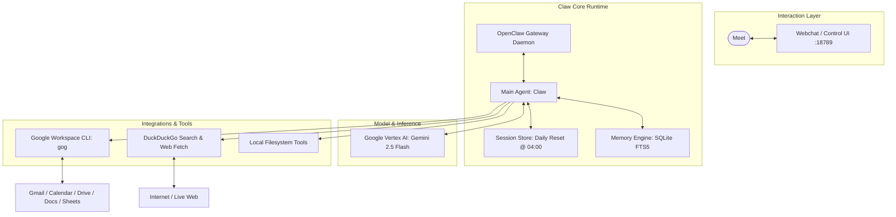

# Claw — Personal AI Assistant

> **Status:** Active Dogfooding & Development  
> **Target:** Meet's Personal AI Assistant built on OpenClaw  
> **Philosophy:** Powerful Backend + Simple User Experience + Safe Defaults  

---

## 1. What Claw Is
**Claw** is a private, local-first personal AI assistant engineered for executive intelligence, calendar and communication management, research synthesis, and local task orchestration. It runs on top of the OpenClaw multi-channel runtime, communicating with Google Cloud Vertex AI via Application Default Credentials (ADC) and interfacing with Google Workspace through a dedicated native CLI (`gog`).

## 2. What Claw Is NOT
- **Not Mesnium:** Claw is a personal dogfooding assistant for Meet, not the commercial multi-tenant product initiative (Mesnium).
- **Not a Public Distributable / SaaS:** Claw is not currently packaged for external users, Docker deployments, or cross-platform installers.
- **Not an Autonomous Unsupervised Agent:** Claw strictly enforces human-in-the-loop confirmation boundaries for external mutations (sending emails, altering calendar invites, deleting files).

---

## 3. System Architecture Overview



---

## 4. Current Capabilities & Baseline

| Subsystem | Configuration / Engine | Status |
| :--- | :--- | :--- |
| **Primary Model** | `google-vertex/gemini-2.5-flash` | Active via GCP ADC (`gen-lang-client-0255502107`) |
| **Agent Profile** | `main` agent under `coding` tool profile | 1 Active Agent, 0 Subagents currently active |
| **Google Workspace** | `gog.exe` authenticated as `m16bshah@gmail.com` | Gmail, Calendar, Drive, Docs, Sheets, Contacts |
| **Web Search** | DuckDuckGo (`duckduckgo`) | Native, zero-token, privacy-preserving |
| **Web Reading** | Native HTTP markdown extractor (`web_fetch`) | Fast, headless-free page extraction |
| **Memory Engine** | Built-in SQLite FTS5 Full-Text Indexing (`fts-only`) | Indexes `MEMORY.md` and `memory/*.md` with zero vector API cost |
| **Session Lifecycle** | `per-sender` scope, `dmScope: main`, daily reset at 04:00 | Safeguard compaction active |
| **MCP** | Subsystem present, 0 servers configured | Native tools preferred during dogfooding |
| **Browser (CDP)** | Extension present, tool disabled in profile | Kept disabled to minimize attack surface |

---

## 5. Security & Safety Model

1. **Local Secrets Isolation**: All private OAuth tokens, GCP credential paths, gateway tokens, and SQLite session logs remain strictly on the local machine and are excluded via `.gitignore`.
2. **Deterministic Confirmation Boundaries**:
   - **Autonomous Execution**: Reading emails, checking calendars, searching Drive, local file reads, web searches, and memory retrieval.
   - **Explicit Confirmation Required**: Sending outbound emails, altering or deleting calendar events, modifying Drive files, and executing arbitrary shell scripts.
3. **Hard Gateway Denials**: Gateway nodes block invasive OS commands (`camera.snap`, `screen.record`, `sms.send`, `contacts.add`).

---

## 6. Repository Layout

```
claw/
├── config/                  # Sanitized configuration & approval templates
│   ├── openclaw.json.template
│   ├── env.template
│   └── exec-approvals.json.template
├── docs/                    # Architectural & operational documentation
│   ├── architecture.md      # Detailed runtime & subsystem architecture
│   ├── connectors.md        # Google Workspace & web connector specifications
│   ├── security.md          # Security posture, secret handling, & permissions
│   ├── dogfooding.md         # Daily usage workflow & operational checklist
│   ├── decisions.md         # Architecture Decision Records (ADRs)
│   └── fos-audit.md         # Comparative analysis against FOS backend blueprint
├── workspace-templates/     # Clean identity, soul, user, and agent templates
│   ├── IDENTITY.md
│   ├── USER.md
│   ├── SOUL.md
│   ├── AGENTS.md
│   ├── TOOLS.md
│   ├── HEARTBEAT.md
│   └── MEMORY.md.template
├── skills/                  # Bundled OpenClaw skill extensions
├── dist/                    # Compiled OpenClaw runtime distribution
├── src/                     # Core runtime sources
├── openclaw.mjs             # Node.js entry point launcher
└── package.json             # Package manifests and dependency tree
```

---

## 7. Current Dogfooding Phase

We are actively dogfooding Claw to validate:
- Reliable Google Workspace read/write triage workflows.
- Accurate SQLite FTS5 long-term memory retrieval.
- Daily briefing compilation (Calendar + Gmail triage).
- Safe human-in-the-loop confirmation UX.
