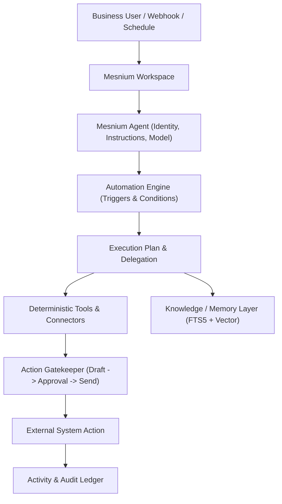

# Mesnium Agent & Automation Engine Blueprint

## 1. Executive Summary

This blueprint defines the architecture for Mesnium's Agent and Automation Engine based on the Phase 10 capability audit of OpenClaw. Mesnium builds on top of OpenClaw's battle-tested execution primitives while introducing a product-level abstraction layer that hides technical complexity from business users.

---

## 2. Core Execution Model

---

## 3. Capability Reuse Matrix

| Capability | Reuse | Wrap | Modify | Rebuild | Reject | Rationale |
| :--- | :---: | :---: | :---: | :---: | :---: | :--- |
| **Agent Execution Loop** | $\checkmark$ | | | | | ReAct loop, token budgeting, and turn queueing are rock-solid. |
| **Subagent Spawning (ACP)** | | $\checkmark$ | | | | Wrap `sessions_spawn` and announce delivery behind clean delegation tasks. |
| **Cron Scheduler** | | $\checkmark$ | | | | OpenClaw cron engine in Gateway handles persistence, timezones, and retries. |
| **Heartbeat Wakeups** | $\checkmark$ | | | | | Periodic check-ins, active hours, and flood guards work well. |
| **Task Ledger** | | $\checkmark$ | | | | Background task tracking with terminal state persistence. |
| **Action Approvals** | | | $\checkmark$ | | | Extend native approval gate for human-in-the-loop email & calendar mutations. |
| **Direct Shell/Exec** | | | | | $\checkmark$ | Reject raw bash/shell in user-facing business agents for security. |
| **Raw Gateway RPC** | | | | | $\checkmark$ | Conceal all internal Gateway RPCs behind Mesnium product APIs. |

---

## 4. Mesnium Product Objects

1. **Workspace**: Multi-tenant isolation boundary for data, agents, and sources.
2. **Agent**: Defined by Name, Avatar, Role, System Prompt, Knowledge Scopes, Tool Access, and Model Ref.
3. **Knowledge Source**: Local directories, Google Drive folders, or database connectors.
4. **Connection**: Authenticated third-party ecosystem (e.g. Google Workspace).
5. **Automation**: `WHEN (trigger) IF (condition) THEN (agent/tool) REQUIRE (approval) RESULT (activity)`.
6. **Task**: Detached execution run with progress tracking and state logging.
7. **Action**: Proposed system mutation (e.g., Send Email, Reschedule Event).
8. **Approval**: Human review item with one-click Accept/Reject affordances.
9. **Activity**: Searchable audit log of all system runs, decisions, and outcomes.

---

## 5. Security & Permission Boundaries

- **Safe Autonomous Workflows**: Classification, summarization, knowledge indexing, schedule lookups, search.
- **Human Approval Required**: Sending emails, creating/modifying calendar events, CRM mutations, financial actions.
- **Strictly Disabled**: Arbitrary shell execution, raw filesystem deletion outside workspace, credential dumping.
