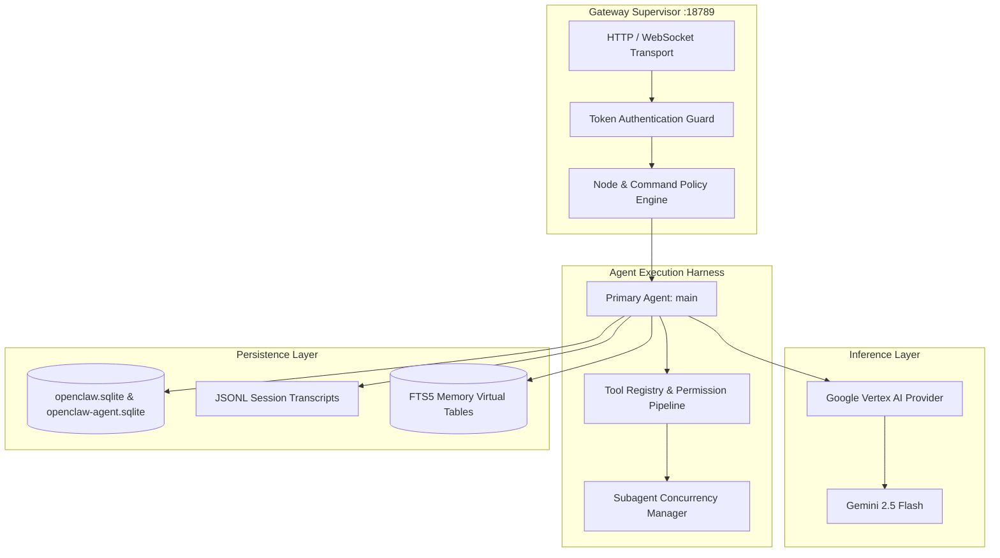

# Claw Runtime Architecture

## 1. Overview

Claw operates as a local-first intelligent assistant layered upon the OpenClaw multi-channel runtime. It is structured around an event-driven Gateway supervisor that manages agent execution, tool dispatch, session persistence, and full-text memory indexing.

---

## 2. Core Subsystems

### A. Gateway Supervisor
- **Transport**: Binds to `127.0.0.1:18789` (loopback only) with shared secret token authorization.
- **Protocol**: Exposes real-time JSON-RPC over WebSockets and HTTP REST for status, tool catalogs, and chat sessions.
- **Node Policy**: Hardcoded `denyCommands` list blocks low-level hardware capturing (camera snaps, audio clips, screen recording) from untrusted surfaces.

### B. Agent Harness & Execution Loop
- **Primary Agent**: `main` configured with workspace `C:\Users\Meet\.openclaw\workspace`.
- **Tool Resolution**: Resolves tool permissions through the `coding` profile, enabling filesystem operations, runtime execution, web research, memory queries, and Google Workspace commands.
- **Subagent Manager**: Supports spawning isolated child agents via `sessions_spawn` with up to 8 concurrent background runs.

### C. Inference & Model Routing
- **Provider**: `google-vertex` using Google Cloud Application Default Credentials (ADC) located in `%APPDATA%\gcloud\application_default_credentials.json`.
- **GCP Project / Location**: `gen-lang-client-0255502107` / `us-central1`.
- **Primary Model**: `gemini-2.5-flash` with a 1,048,576 token context window and 65,536 max output tokens.

### D. Memory Engine
- **Engine Type**: Built-in SQLite FTS5 (Full-Text Search).
- **Index Scope**: Indexes `memory/MEMORY.md` and `memory/*.md` chunked at 400 tokens.
- **Vector Provider**: Explicitly set to `"none"`. Deterministic lexical ranking eliminates embedding model latency, external API calls, and vector drift.

### E. Session Management & Compaction
- **Scope**: `per-sender` with `dmScope: "main"` so 1-on-1 conversations persist across client reconnections.
- **Reset Schedule**: Daily reset at `04:00 AM` (`idleMinutes: 1440`).
- **Compaction**: `safeguard` compaction mode truncates old conversational turns while keeping system directives, identity headers, and recent context intact.
