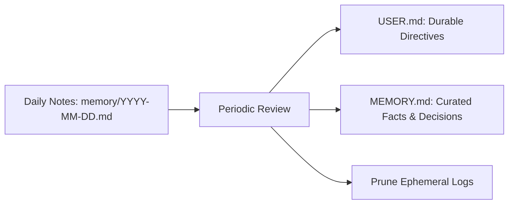

# Claw Dogfooding & Operational Guide

## 1. Dogfooding Objective

We are actively testing Claw as Meet's primary personal assistant. The goal of this phase is to establish high reliability across daily executive tasks before adding broader automation or complex integrations.

---

## 2. Daily Interaction Rituals

### Morning Briefing (08:00 AM)
1. **Calendar Review**: Check agenda for the day, highlight back-to-back meetings, identify missing agendas.
2. **Inbox Triage**: Surface top 3–5 high-priority unread emails requiring action.
3. **Pending Commitments**: Review unresolved items from `memory/` or yesterday's session.

### Ad-hoc Task Delegation
- **Research & Summarization**: "Summarize this article: `<url>`" -> uses `web_fetch`.
- **Drafting Communications**: "Draft a reply to [Sender] regarding [Topic]" -> creates draft in Gmail via `gog` and presents for review.
- **Drive & Docs Retrieval**: "Find the design doc for [Project]" -> queries Drive and returns summary.

### Evening Consolidation (06:30 PM)
- **Recap**: What was accomplished, what needs to roll over to tomorrow.
- **Memory Update**: Significant lessons or durable preferences folded into `MEMORY.md` or `USER.md`.

---

## 3. Memory Maintenance Workflow

1. **Daily Notes**: Raw turn notes land in `memory/YYYY-MM-DD.md`.
2. **Curated Consolidation**: Weekly or during evening wrap-up, distilled facts are migrated to `MEMORY.md`, and durable directives are updated in `USER.md`.
3. **FTS Indexing**: SQLite FTS5 indexes updates immediately upon file modification.

---

## 4. Operational Troubleshooting

| Symptom | Cause | Resolution |
| :--- | :--- | :--- |
| **Gateway unreachable** | Gateway daemon stopped | Run `openclaw gateway` or restart background task |
| **Google Workspace auth error** | OAuth token expired | Run `gog auth login` in terminal |
| **Vertex AI error** | ADC credentials expired | Run `gcloud auth application-default login` |
| **Memory not found** | FTS index out of sync | Save `MEMORY.md` or trigger reindex via `memory_search` |
